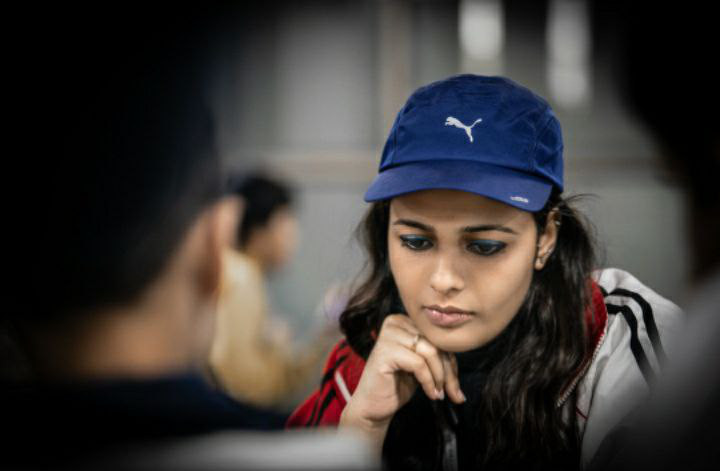
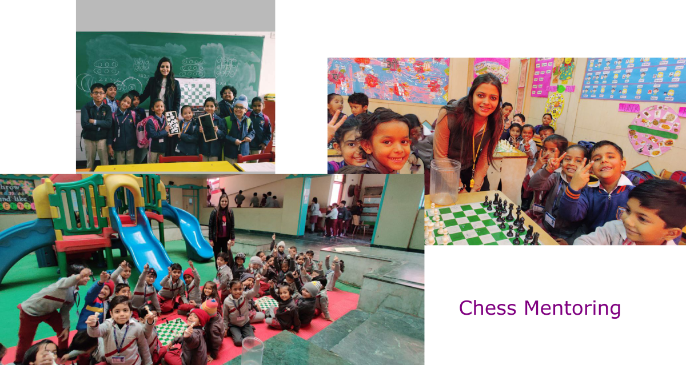
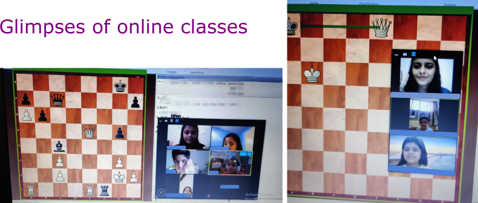

## Learn chess fundamentals with Aishwarya

I am a chess educator, National Instructor, FIDE Arbiter, and International Rated chess player with elo Rating of 1582. I graduated from Shri Ram College of Commerce (SRCC) in B.Com. (Hons) and later decided to pursue my passion in chess. I am interested in exploring ways chess can help child nurture their problem solving skills. Chess is part of curriculum in many schools across the world due to cognitive development benefits this sport brings in a child’s life. I have an experience of working with children to introduce them to the foundational concepts of chess in a meaningful and engaging way. I have been coaching and mentoring children in chess since the past 4+ years. I am also interested in designing equitable learning opportunities and courses to popularize chess among young people. 

  

## Why chess?

Research from around the world reveals that chess can be used as a learning tool to improve children’s critical thinking and problem-solving skills. Various studies have shown that chess makes children more reflective and enhances visual memory, attention span, spatial skills, and  decision-making.  
With the vision to make chess accessible to children with little or no chess background, the online academy envisages to provide a platform to nurture innate curiosity and creative expression and sharpen analytical thinking in every child. The game of chess teaches important life skills such as emotional intelligence and thinking beyond the present moment, and sportsmanship.

## Key highlights

The online academy provides
- Structured classes
- Live Interaction 
- Problem-solving techniques
- Online Tournaments
- Puzzles to challenge tactical thinking skills 
- Certificate to participants on completion of course
- Collaborative Learning (Have a cohort to work along)
- Curriculum designed for children

## To enrol for the course, kindly reach out

> **email:** _aishwarya4080@gmail.com_  
> **phone no:** +91 - 7739304438  
> You can also fill the form [here](https://docs.google.com/forms/d/e/1FAIpQLSel70RD2ATSbWHFtL2qOEg09xEYcKQj_FpQ2b2helC9SGYRaQ/viewform)

## About the curriculum

### The Beginner Curriculum (Level - I)

The Beginner Level I course is designed for 6 months. This level deals with the basics. The students will learn about the chessboard, piece movement. Also the different stages of the game, chess tactics, various tricks that can be applied in the game.

The following topics will be explored:

- About chess pieces and its value
- Purpose of game
- The art of moving the Pieces
- Attacking & Capturing Pieces
- Checkmate
- Stalemate
- Special moves
  * En passant
  * Castling
  * Pawn promotion  
- Chess notation
- Introduction to three phases of the game (opening, middle game, and endgame)
- Opening Principles
- Endgame
  * Single Queen Checkmate
  * Single Rook Checkmate
  * Double Rook Checkmate  
- Middle Game Combination
- Pawn promotion and Simple king pawn endgame
- Mate in one
- Trapping pieces
- Game Analysis
- Tactics
  * Fork
  * Pin
  * Discovery
  * Skewer
  * Double Attack
  * Double-Check
  * Decoy
  * Removal of the Guard
  * Deflection
  * Overloading
  * Mixed Tactics

### The Beginner Curriculum (Level - II)

The Beginner Level II course is designed for 6 months. This level deals with the different types of checkmate patterns. A good start should also end with a good finish. We will learn some simple strategies that help us dominate the ending stage. We will also learn new tactics such as windmill, intermediate moves, clearance sacrifice etc. that can be applied in the game.

The following topics will be explored:

- Smothered mate
- Greek-gift sacrifice
- Windmill
- Queen vs 7th rank pawn endgame
- Mixed combinations
- How to take advantage of the open file, open diagonal, and the rank
- Perpetual check
- Introduction to the openings
- Forced variations
- Clearance Sacrifice
- Intermediate moves
- Queen rook battery
- Queen bishop battery
- Mating Patterns:
  - Anastasia's mate
  - Arabian mate
  - Boden's mate
  - Pillsbury's mate
  - Lolli's mate
  - Damiano's mate
  - Hook mate
  - Legal's mate
  - Morphy's mate  
- Mate in two moves
- Short Tactical Games
- Best Games of the Grandmasters
- Stalemate combinations
- Bishop Knight checkmate
- Double Bishop Checkmate

## Achievements of Ms Aishwarya

**Chess (2005 – Present): International Chess Player with FIDE rating 1582, played 8 international rated tournaments**

- Awarded the title of National Instructor by FIDE (World Chess Federation) in 2020 by successfully clearing the examination.
- Awarded the title of FIDE Arbiter by FIDE (World Chess Federation) in 2020 by successfully clearing the examination.
- Secured 3rd position in Delhi State Women Chess Championship 2019
- Represented Delhi State in Senior National Women Chess Championship 2019
- Secured 14th rank in Asian Youth Chess Championship in under 10 girls category held at New Delhi on December 2005
- Declared winner of Delhi University Inter College Chess Competition in the academic year of 2014-15,15-16 and 16-17
- Secured 1st position in North Zone Inter-University Chess Championship held in 2015-16 and 2016-17
- Secured 3rd position in All India Inter-University Chess Championship held in 2015-16 and 2016-17
- Represented Jharkhand State more than eight times in National Level from 2006-13
- Secured 1st – 4th position in Jharkhand State Chess Championship held between 2005 and 2013
- Secured consecutively 1st positions in All India Inter DPS Chess Championship held in 2007-08, 2008-09, and 2010-11
- Secured 1st position in CBSE National Chess Championship in under 19 girls individual category held in 2011-12
- Secured 1st & 2nd position in CBSE National Chess Championship in under 14 girls category held in 2008-09 & 2009-10
- Secured 1st position in CBSE East Zone Chess Tournament 2010-11 & 2013-14 respectively in (under 19 age group)
- Secured 1st - 3rd positions in every CBSE East Zone Chess Tournament (under 14 age group) held between 2005 - 2010
- Secured 1st position in every Dhanbad District Chess Championship women category held between 2005 - 2013
